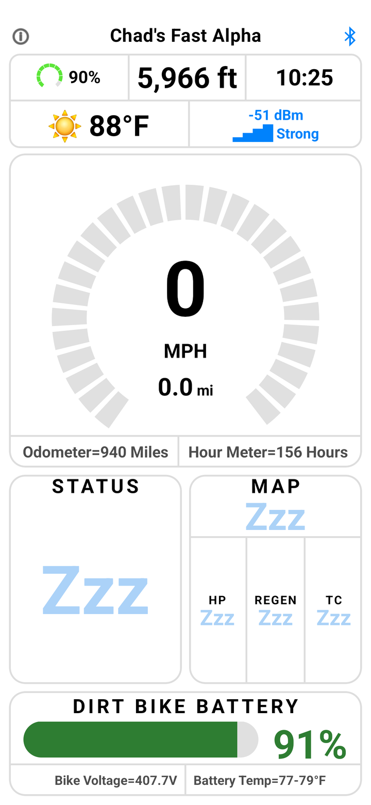
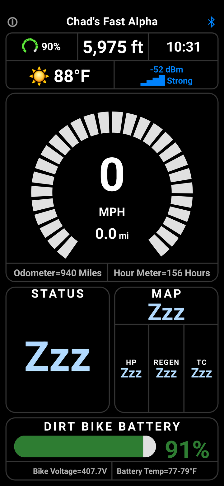
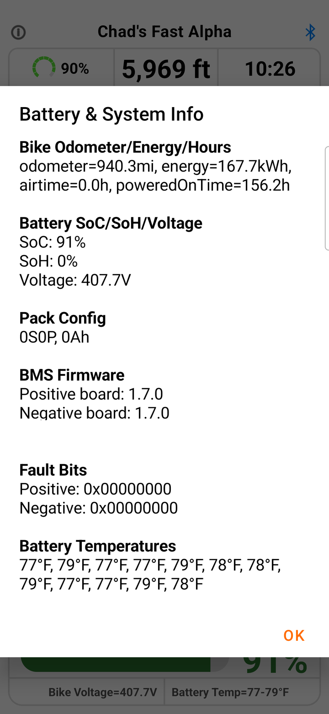
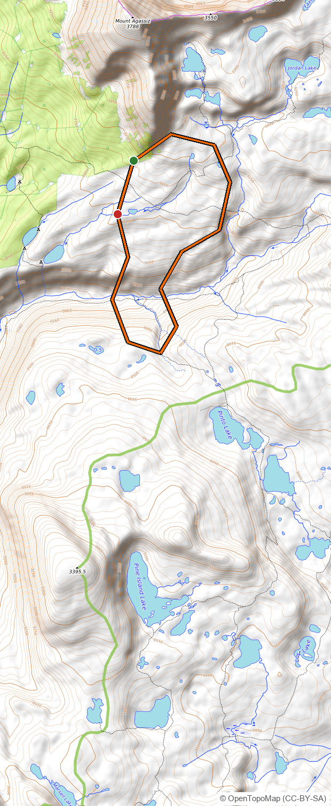

<!--
  This is the PUBLIC repo's landing page. It is synced to the root README.md of the public
  transparency mirror (chadware-software/WolfPackDash-Docs) by scripts/sync-public.ps1 and the
  publish-docs workflow. Edit THIS file to change the public README — do not edit the mirror directly.
  See docs/PUBLIC_SYNC.md for how the sync works and what is / isn't published.
-->

# WolfPack Dash 🐺 — Documentation & Transparency

**A glove-first dashboard for electric dirt bikes.** WolfPack Dash mounts on the handlebars and shows
your bike's live telemetry — speed, battery, range, temperatures — over a full-screen offline topo
map, all in big glove-friendly readouts. It's **freeware**, has **no accounts and no tracking**, and
only ever **reads** from the bike.

> **What this repo is.** This is the **public documentation & transparency mirror** for WolfPack Dash.
> The app is in active development and its source is **currently private**; this repo carries the
> docs, the full security model, and the secret-free cloud-backup infrastructure, kept in sync from
> the main repo. It's here so anyone can see exactly what the app does with data and how it's secured
> — without taking our word for it.

---

## 📸 A look at it

---

## 🔒 Transparency first

We'd rather show you the edges than pretend there are none. Start here:

- **[SECURITY.md](SECURITY.md)** — a 2-minute, plain-English summary of what the app does with your
  data and how it's secured, honest limitations included.
- **[docs/SECURITY_DEEP_DIVE.md](docs/SECURITY_DEEP_DIVE.md)** — the full security-engineer / pen-test
  treatment: threat model, trust boundaries, attack-surface enumeration, cryptography review,
  abuse-case walkthroughs, and ranked hardening recommendations.
- **[docs/PROCESS_FLOW.md](docs/PROCESS_FLOW.md)** — how the app actually works, process by process,
  with flow diagrams.
- **[worker/](worker/)** — the *entire* cloud write-proxy source (a ~60-line Cloudflare Worker). It's
  the only thing that can write to our cloud storage, and it's here so you can read exactly what it
  does. It holds no secrets.

The short version: **the app holds no cloud credentials**, your **ride data and location never leave
your phone**, and anything that does touch the cloud (opt-in settings backups) is **encrypted on your
device first** — the cloud only ever stores unreadable ciphertext.

---

## ✨ What it does

- **Live instrument cluster** over a full-screen offline **topo map** — speed, battery %, range,
  pack/motor temperatures, ride mode, odometer, clock, and more.
- **Glove-first** — big targets, tap-the-top-to-go-back navigation, bar-mounted landscape layout.
- **Works with or without a bike** — a generic "any bike" phone-only mode, plus richer live data when
  connected.
- **Your setup, backed up** — save your theme and layout to the cloud with a **backup code** and
  restore it on another phone. No account; the code is the only key, and we can't see it.
- **Read-only & private** — it displays telemetry, never commands the bike, and never phones home
  about you.

---

## ❓ FAQ

**Is this an open collaboration project? Can I contribute code?**
No — and that's on purpose, no offense meant. WolfPack Dash is a personal project Chad wrote for
himself, his wife Colleen, and their dirt-bike buddies. It's shared as freeware because sharing is
fun, but it isn't a community or collaboration project. All of the code and everything in these repos
belongs to **Chadware and its developers**.

**Can I send feature ideas, suggestions, or feedback? Can I contact Chad with ideas?**
Kindly, no. Chad builds this in his own direction for his own crew, so he isn't taking feature
requests, suggestions, comments, or "hey, could it also…" ideas — and please don't reach out to him
with them. It keeps a hobby project simple and fun. Just use it and enjoy it as it is. (The **one**
exception is security problems — see below — because those keep everyone safe.)

**Is it really free? What's the catch?**
It's genuinely free for anyone to install and use — no accounts, no ads, no tracking, no catch. It's
freeware for everyone, simply **controlled by Chadware**: Chad decides what it does and where it goes.

**Who owns it? Is Chadware a company?**
Everything belongs to **Chadware and its developers**. "Chadware" is just the name Chad's projects go
under — think of it like the shop name painted on a personal build, not a big corporation. The point
is only that the work is Chad's and his crew's.

**Is my information secure and private?**
Yes — and we explain exactly how, rather than asking you to take our word for it. The short version:
no accounts, no tracking; your **ride data and location never leave your phone**; the app only
**reads** from the bike; and the only thing that ever touches the cloud is an **optional, encrypted**
settings backup that **only you** hold the key to. Full detail is in **[SECURITY.md](SECURITY.md)** and
the **[security deep dive](docs/SECURITY_DEEP_DIVE.md)**.

**What bikes does it work with?**
It's built around the electric dirt bikes Chad and Colleen ride, and it also runs as a **phone-only
dashboard** for just about any bike (with a smaller feature set when it isn't connected to one). It's
an independent app and isn't affiliated with, endorsed by, or sponsored by any bike manufacturer.

**I found a security problem — can I tell you?**
Yes, please — that's the one kind of feedback we always want, because it protects everyone. Open an
issue (see [SECURITY.md](SECURITY.md)); mention if it's sensitive and we'll arrange a private channel.

## 🙏 Built with care

WolfPack Dash is a personal, non-commercial project made for a few friends and their bikes. Maps ©
OpenStreetMap contributors, © OpenTopoMap (CC-BY-SA), and USGS (public domain); weather by
[Open-Meteo](https://open-meteo.com).

*Questions about the security model? See [SECURITY.md](SECURITY.md) or open an issue.*
