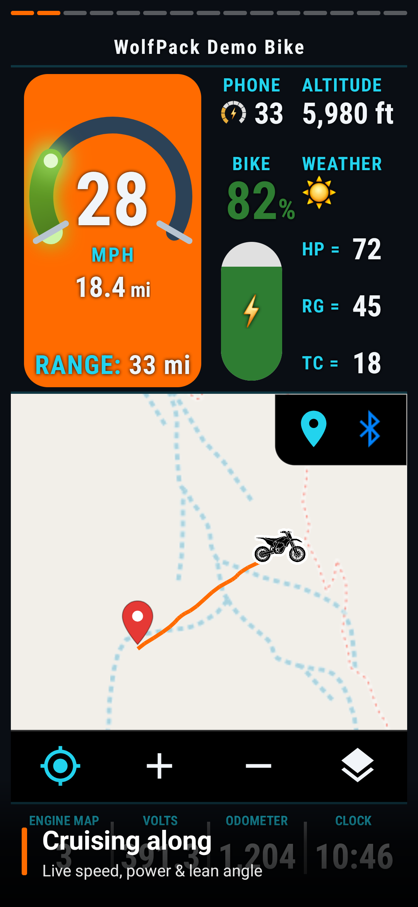
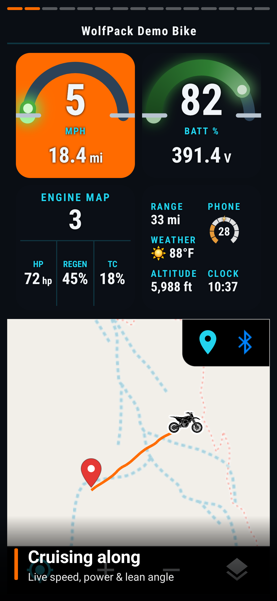
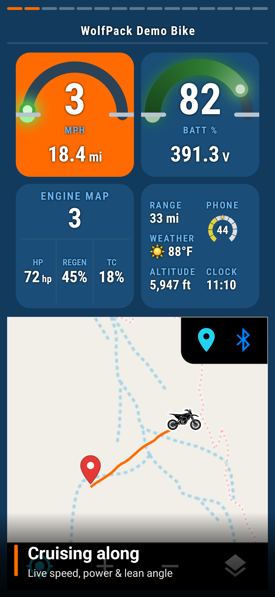
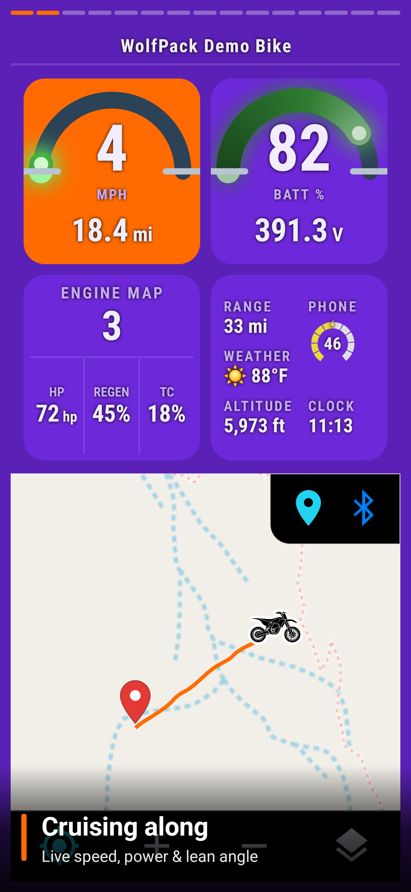
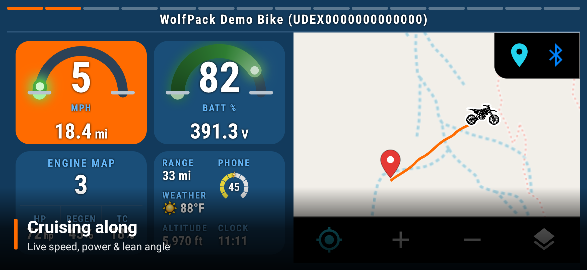

<!--
  This is the PUBLIC repo's landing page. It is synced to the root README.md of the public
  transparency mirror (Chadware-Garage/WolfPackDash-Docs) by scripts/sync-public.ps1 and the
  publish-docs workflow. Edit THIS file to change the public README — do not edit the mirror directly.
  See docs/PUBLIC_SYNC.md for how the sync works and what is / isn't published.
-->

# 🐺 WolfPack Dash

### _The Art of Possible_

**A free, glove-first Android dashboard for most any dirt bike — with live Bluetooth Low Energy
telemetry on supported electric bikes.**

> 🐺 **It's out, and it's free.** Built by riders, for riders, and given away free to anyone who can
> use it — still in active development, at our own pace, so it only keeps getting better.

## ⬇️ [Download WolfPack Dash](https://get.chadman.net)

**No app store · no account · no ads · Android only**

Open that link on your Android phone and it downloads the signed app; open it on a computer and it
shows a QR code to scan with your phone. After the one-time install, WolfPack Dash keeps itself
updated over the air — so you only ever sideload it once.

---

WolfPack Dash bolts to the handlebars and turns your phone into a full instrument cluster: GPS speed,
trip stats, and an offline topo trail map that keep working with no signal on **any** dirt bike — and
on a supported **electric** bike it adds live speed, gear state, and deep battery health over
Bluetooth. It's **freeware** for fellow riders and **strictly read-only** with the bike: it only ever *reads*
telemetry and never sends a command that controls the bike. No accounts, no ads, no Google Play Services — and
**your bike's telemetry never leaves the phone**.

> **What this repo is.** This is the **public documentation & transparency mirror** for WolfPack Dash.
> The app is **free and in active development**, and its core features already work great — but it's a
> living project that keeps evolving: a few sections are still partial or not started yet, and more is
> always being added, so expect regular changes. The app's source is **currently private**; this repo carries the
> docs, the full security model, and the secret-free cloud infrastructure, kept in sync from the main
> repo. It's here so anyone can see exactly what the app does with your data and how it's secured —
> without taking our word for it. Jump to [Transparency](#-transparency-first).

---

## 📸 A look at it

The cluster in motion — speed, throttle, gear and battery, animating right here in the README

<b>Two dashboards · 21 color themes · portrait &amp; widescreen</b>

Lone Wolf &amp; Pack View, recolored — WolfPack, Navy, and Dark Purple, 3 of 21 themes

Same cluster, widescreen — for however your bars sit

  

  

  

Live telemetry over an offline topo map · 21 themes · battery &amp; charging alerts · glove-first menu

---

## ✨ Highlights

- 🏍️ **Live dashboard** — speed, throttle, gear state, odometer, and trip stats at a glance
- 🔋 **Deep battery insight** — pack %, per-cell voltages, temperatures, cell balance, and fault alerts
- 🗺️ **Offline trail maps** — Street, topo, USGS & satellite layers; save a region, or import a whole
  state as an offline **vector map**
- 🛰️ **Ride tracking** — GPS logging with altitude/speed graphs and GPX/KML/CSV export
- 📍 **Never lose the bike** — GPS speed backup if the link drops, a "find my parked bike" last-seen
  pin, and (on Option 1) drop a **waypoint** with one glove tap and retrace your recorded
  track back to it
- 🎨 **Themes & colors** — swap the whole dashboard layout and color palette from a picker, applied
  app-wide; status colors (battery, throttle, gear) stay fixed so warnings always read the same
- 🌡️ **Trailside weather** — live outside temperature and a forecast pulled onto the dashboard, no
  API key and no account
- 🔄 **Sideload once** — no app store required; after the first install it quietly keeps itself
  updated over the air, and every update is signature-checked before it installs
- 🔐 **Private by design** — read-only, on-device, no telemetry ever leaves the phone

---

## 📊 The dashboard

| Tile | What it shows |
| --- | --- |
| ⏱️ **Speed** | A speedometer in Standby/Neutral that flips to **throttle position** (green → red) in Drive or Crawl. Below it: a GPS trip meter, plus the bike's own odometer and hour meter. **Trip Stats** track avg/high/low altitude, avg/max speed, elapsed time, and distance. |
| 🚦 **Status** | The current gear state as a live-animated icon — **Standby, Neutral, Reverse Crawl, Forward Crawl, Drive** — that switches to a pulsing **charging** display with an estimated kW rate the moment a charger is plugged in. |
| 🗺️ **Map** | The active ride map and its HP / Regen / Traction-Control figures, over a dark topo map that follows you. The full **Ride Map** opens from the menu. |
| 🔋 **Battery** | Live pack % and a segmented gauge, a voltage/temperature row that amber-flashes on out-of-range temps, and an **Engine Fault** alert if the bike reports one. Full diagnostics cover state of health, pack configuration, temperatures, cell balancing, and every cell's voltage. |

Two dashboards ship, and you switch between them anytime under Themes. The default **Option 1** is the
big, glove-friendly cockpit — huge speed & battery, a central map, and range at a glance, laid out as
large tap-tiles for gloved hands. **Option 2** presents the same readings as one info-dense instrument
cluster — a big speed readout ringed by a live **throttle** meter, a tall **battery** gauge with charge
% and range, and live **altitude / weather**, all over a **topo map** that follows you.

🧤 **Glove-first.** Everything is a big, glove-sized target. Tapping the **top banner** opens a
full-screen menu of big buttons — **Settings, Map, Weather, Bluetooth, Themes, Help, About, and
Donate** — and the dashboard's own tiles open **full-screen info pages** (trip stats with an elevation
chart, battery diagnostics, weather, and a combined GPS + connection telemetry page), each
auto-returning to the dash after a few seconds so nothing sits covering the trail.

---

## 🛰️ Rides & maps

- **Ride Map** — a full-screen map (via osmdroid, no Google) centered on you as a **dirt-bike marker**
  that faces your travel direction. Draw a recorded ride with Start/Finish pins and **replay** it as a
  fly-through. Cycle four free layers: **Street, Topo, USGS Topo, and Satellite**.
- **Three ways offline** — pre-download the current view, grab a 5/10/25-mile radius of USGS Topo or
  Satellite, or import a single free **OpenAndroMaps `.map`** file and the **Vector (offline)** layer
  renders a *whole state* at every zoom with no signal.
- **Find my parked bike** — while connected, the app remembers where the phone last was with the bike;
  if a later scan can't reach it, you get its last-seen location as a map pin.
- **GPS speed backup** — if the bike link drops mid-ride, the speedometer keeps running off the
  phone's GPS, tagged **GPS**, and hands back when the bike reconnects.
- **Ride tracking & graphs** — log GPS along each ride (or auto-breadcrumb a trail whenever the bike's
  connected), then view altitude/speed/distance charts, or export **GPX**, **KML**, or full **CSV**.

---

## 🎨 Make it yours

Swap the whole dashboard (**Option 1**, the glove-friendly cockpit, or **Option 2**, the info-dense cluster) and pick a
color palette — several dark themes that reskin every screen, mixed and matched and applied app-wide.
Set thresholds (low-battery, cell-balance, temperature), tune haptics, keep-screen-on, dim-&-sleep-when-parked,
and units — then **back your whole setup up to the cloud with a backup code** and restore it on another
phone. No account; the code is the only key, and it's encrypted on your device first, so we can't read it.

---

## 📊 By the numbers

A snapshot of what's under the hood (a lot, for a personal project):

| | |
|---|---|
| 🧑‍💻 **Language** | **100% Kotlin** |
| 📏 **Source** | **~21,000** lines of Kotlin · **~11,600** lines of XML — **~33,000 lines** total |
| 🖥️ **Screens** | **20+** activities — two full dashboard designs, offline ride map, settings, themes, cloud backup, and more |
| 🎨 **Themes** | **21** built-in color themes |
| 📡 **Live telemetry** | **47** live bike data fields the bike broadcasts — speed, battery %, cell balance, pack/motor temps, charger, range… |
| 📚 **Docs** | a process-flow guide, a pen-test-grade security deep dive, and these public transparency pages |
| ☁️ **Cloud** | one **~80-line** Cloudflare Worker fronts every write; the app itself carries **zero cloud credentials** |
| 🛠️ **How** | Built end-to-end by directing AI — design, code, and docs |

> ⏱️ **And how long did all this take?** About **10 days.** Colleen headed out on a three-week
> vacation on July 2nd — and this is what happens when you leave a dirt biker home alone with a laptop
> and way too much free time. ~33,000 lines of Kotlin later, here we are. Send help (or a trail map). 🐺

---

## 🔒 Transparency first

We'd rather show you the edges than pretend there are none. Start here:

- **[SECURITY.md](SECURITY.md)** — a 2-minute, plain-English summary of what the app does with your
  data and how it's secured, honest limitations included.
- **[docs/SECURITY_DEEP_DIVE.md](docs/SECURITY_DEEP_DIVE.md)** — the full security-engineer / pen-test
  treatment: threat model, trust boundaries, attack-surface enumeration, cryptography review,
  abuse-case walkthroughs, and ranked hardening recommendations.
- **[docs/PROCESS_FLOW.md](docs/PROCESS_FLOW.md)** — how the app actually works, process by process,
  with flow diagrams.
- **[worker/](worker/)** — the *entire* cloud write-proxy source (a ~80-line Cloudflare Worker). It's
  the only thing that can write to our cloud storage, and it's here so you can read exactly what it
  does. It holds no secrets.

The short version: **the app holds no cloud credentials**, your **ride data and location never leave
your phone**, and anything that does touch the cloud (opt-in settings backups and app updates) is either
a plain anonymous public download or **encrypted on your device first** — the cloud only ever stores
unreadable ciphertext.

---

## 🤝 Working together

We're not taking feature requests — but there's one conversation we'd genuinely love to have.

WolfPack Dash exists because we wanted a better, glove-friendly way to see **our own** bikes' telemetry
on the trail — so we built it, and kept it **strictly read-only** with the bike.

We think there's a great future in **official, blessed, read-only telemetry access** for independent
builders: it lets people like us make genuinely useful tools for riders — without ever touching anything
that controls the bike. Open to **read**, locked down to **write**: better for riders, and safe for the
maker.

If you build electric bikes and that idea resonates — or you can help make an introduction happen — that
door is **wide open**. Please [open an issue](../../issues) and we'll take it somewhere good from there.

---

## ❤️ Donate — support the trails

WolfPack Dash is **freeware**, and **I don't make a cent from it** — no ads, no accounts, no data sold,
nothing. If you enjoy the app, have a little extra cash, and want to help out your fellow dirt bikers,
please consider donating to any of the groups below. These are the folks who promote riding, keep our
trails in shape, cut more trees off the trail in a year than you can imagine, get new trails built, and
do amazing work on the trails we already have — they're a big part of why this app exists.

**🌲 [WestCore](https://www.westcore.co/)** — Chad's local trail group in Montrose, Colorado (he's a
member). Their volunteer crews clear **hundreds of downed trees** off the trails every season, keeping
the local backcountry open and rideable when nobody else will. If you've ever rolled up on a freshly
cleared trail, odds are a crew like this made that happen.
**→ Donate: [westcore.co](https://www.westcore.co/)**

**⛰️ [Trails Preservation Alliance](https://coloradotpa.org/pages/donate)** — a Colorado trail &
dirt-bike / motorsports non-profit doing the heavy lifting across the whole state. They run their
**own trail crew**, teach riders how to respect the trails so we keep our access, and fight to get
**new trails built without giving up** the old, still-rideable ones. Big-picture work that keeps the
sport alive.
**→ Donate: [coloradotpa.org/pages/donate](https://coloradotpa.org/pages/donate)**

*Every dollar goes **straight to the group** — nothing passes through me, Chadware, or WolfPack Dash.
These are personal shout-outs, never paid placements, and both are independent organizations, not
affiliated with or endorsing this app. (More groups may be added over time.)*

---

## ❓ FAQ

**Is this an open collaboration project? Can I contribute code?**
No — and that's on purpose, no offense meant. WolfPack Dash is a personal project Chad wrote for
himself, his wife Colleen, and their dirt-bike buddies. It's shared as freeware because sharing is
fun, but it isn't a community or collaboration project. All of the code and everything in these repos
belongs to **Chadware and its developers**.

**Can I send feature ideas, suggestions, or feedback? Can I contact Chad with ideas?**
Kindly, no. Chad builds this in his own direction for his own crew, so he isn't taking feature
requests, suggestions, comments, or "hey, could it also…" ideas — and please don't reach out to him
with them. It keeps a hobby project simple and fun. Just use it and enjoy it as it is. (**Two**
exceptions: security problems — see below — and one **partnership** conversation, see the _Working
together_ section — because those two help everyone.)

**Is it really free? What's the catch?**
It's genuinely free for anyone to install and use — no accounts, no ads, no tracking, no catch. It's
freeware for everyone, simply **controlled by Chadware**: Chad decides what it does and where it goes.

**Who owns it? Is Chadware a company?**
Everything belongs to **Chadware and its developers**. "Chadware" is just the name Chad's projects go
under — think of it like the shop name painted on a personal build, not a big corporation. The point
is only that the work is Chad's and his crew's.

**Is my information secure and private?**
Yes — and we explain exactly how, rather than asking you to take our word for it. The short version:
no accounts, no tracking; your **ride data and location never leave your phone**; the app only
**reads** from the bike; and the only thing that ever touches the cloud is an **optional, encrypted**
settings backup that **only you** hold the key to. Full detail is in **[SECURITY.md](SECURITY.md)** and
the **[security deep dive](docs/SECURITY_DEEP_DIVE.md)**.

**What bikes does it work with?**
It's built around the electric dirt bikes Chad and Colleen ride, and it also runs as a **phone-only
dashboard** for just about any bike (with a smaller feature set when it isn't connected to one). It's
an independent app and isn't affiliated with, endorsed by, or sponsored by any bike manufacturer.

**Is there an iPhone version, or will it be ported to iOS?**
No — WolfPack Dash is Android-only and will stay that way. Chad doesn't own an iPhone and doesn't plan
to get one, so there's simply no way for him to build or test an iOS version. Nothing against iPhones —
it's just a personal project built on the hardware he actually rides with.

**Will it run on my phone?**
Honestly, no idea! Chad built it for his own phone and Colleen's, and those are the only devices it's
really tested on. It's a normal modern Android app (Android 8+), so there's a good chance it runs fine
on yours — but that's not a promise, other phones aren't tested, and Chad can't take requests to support
a specific device. If it works for you, great; if it doesn't, no hard feelings.

**I found a security problem — can I tell you?**
Yes, please — that's the one kind of feedback we always want, because it protects everyone. Open an
issue (see [SECURITY.md](SECURITY.md)); mention if it's sensitive and we'll arrange a private channel.

---

## 🙏 Built with care

WolfPack Dash is a personal, non-commercial project made for a few friends and their bikes. Maps ©
OpenStreetMap contributors, © OpenTopoMap (CC-BY-SA), and USGS (public domain); weather by
[Open-Meteo](https://open-meteo.com).

*Questions? See [SECURITY.md](SECURITY.md), the [security deep dive](docs/SECURITY_DEEP_DIVE.md), or [how it works](docs/PROCESS_FLOW.md) — or open an issue.*
