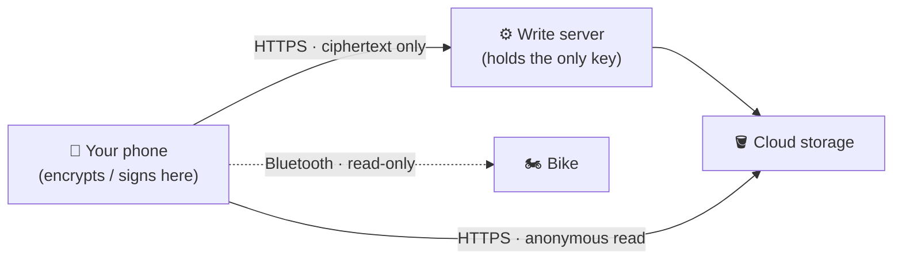

# 🔒 Security & Transparency

WolfPack Dash is **freeware, open source, and personal** — built for a few friends and their dirt
bikes, not a company. This page is the short, honest summary of what the app does with your data and
how it's secured. It's written to be read in a couple of minutes; the full engineering treatment is
linked at the bottom.

> **Our stance:** we'd rather tell you exactly where the edges are than pretend there are none. This
> summary calls out real protections **and** honest limitations. Nothing here is marketing.

---

## 📴 What the app does with your data (the TL;DR)

- **No accounts. No tracking. No analytics.** There is nobody to log in as and nothing phoning home
  about you.
- **Your ride data stays on your phone.** Speed, battery, temperatures, GPS tracks — recorded
  **locally** and **never uploaded**. Uninstall the app and it's gone.
- **Your location never leaves the device.** It's used to show your position on the map and fetch the
  local temperature — it is never sent anywhere tied to you.
- **The bike is read-only.** The app *displays* telemetry; it never sends commands to the bike or
  changes how it rides.
- **The only cloud traffic** is: map tiles, a weather lookup, update checks, and — **only if you
  choose** — an **encrypted** settings backup (theme/layout only, never telemetry or location).

---

## 🛡️ How it's secured (the short version)

- **The app holds no cloud credentials.** There's no key or password baked into it that could damage
  anything. Restoring a backup is an anonymous read; the *only* thing that can write to our cloud is
  a small server component that holds the credential — never the app.
- **Everything cloud-bound is encrypted or signed before it leaves your phone.** Settings backups use
  **AES-256-GCM**; the cloud only ever stores unreadable ciphertext. App updates are **signed** and
  **SHA-256-verified**, and Android refuses any update signed with a different key.
- **Your backup code is the only key to your backup.** It's a random code we never see and can't
  recover. Even the *name* of your backup file in the cloud can't unlock it — the name and the
  encryption key are calculated separately on purpose.
- **It reads bike data over Bluetooth only** — no internet path to your bike exists in the app.

---

## 🧾 Your data at a glance

| Data | Sensitivity | Leaves your phone? |
|---|---|---|
| Speed / battery / temps | Low | **Never** |
| GPS location & ride tracks | Medium | **Never uploaded** |
| Settings (theme, layout, thresholds) | Low (no telemetry) | Only as **encrypted** backup, if you opt in |
| Backup code | Medium (unlocks your backup) | Only in **your** hands |

---

## 🙈 What we're honest about (limitations)

We think transparency means naming the weak spots, not hiding them:

- **This is a personal build, not independently audited.** Trust it accordingly.
- **The dev-profile sync is obfuscation-grade, not bulletproof.** The developer profiles that
  auto-configure a *known* bike are encrypted with a key tied to that bike's serial — and the serial
  is broadcast over Bluetooth. It protects low-value look-and-feel settings; it is not meant to guard
  anything sensitive (and it doesn't carry anything sensitive).
- **Bluetooth security is the bike's, not ours.** The bike's pairing can be derived from its
  broadcast serial (that's how the manufacturer designed it), so being *near* a bike is roughly the
  same as being able to talk to it. Since the app is read-only and the data isn't secret, there's
  nothing to gain — but we won't pretend the Bluetooth link is a vault.
- **A backup code is a real credential.** Anyone you give it to can read and overwrite that backup.
  Keep it like a password; use "Start a new backup code" if one leaks.
- **A rooted or stolen unlocked phone** can read app data locally. We don't defend against that.

The full document below lists these alongside the specific hardening steps on our roadmap.

---

## 🐛 Reporting a security issue

Found something? Please **open an issue** on this repository describing it. This is a non-commercial
personal project, so there's no formal bug-bounty or SLA — but security reports are genuinely
welcome and we'll look at them. For anything you'd rather not post publicly, note that in the issue
and we'll arrange a private channel.

---

## ❓ FAQ

**Is my information secure and private?**
Yes. There are no accounts and no tracking, your ride data and location **never leave your phone**,
the app only **reads** from the bike, and the sole thing that ever touches the cloud is an optional
settings backup that's **encrypted on your device** with a key **only you** hold — so the cloud only
ever stores unreadable ciphertext, and the app carries no cloud credentials. The sections above and
the [deep dive](docs/SECURITY_DEEP_DIVE.md) spell out exactly how.

**Is this a collaboration project? Can I suggest features or contact Chad with ideas?**
No, and no offense meant. WolfPack Dash is a personal project made for Chad, his wife Colleen, and
their dirt-bike buddies. It's freeware for everyone but **controlled by Chadware and its developers** —
Chad drives its direction and isn't taking feature suggestions, comments, or idea requests, so please
don't send those our way.

**But you'll take security reports?**
Yes — that's the one exception. A security issue affects everyone's safety, so those are always
welcome (see *Reporting a security issue* above). A **security report** is welcome; a **feature
request** isn't.

**What bikes does it support?**
The electric dirt bikes Chad and Colleen ride, plus a phone-only mode for just about any bike. It's an
independent app, not affiliated with or endorsed by any bike manufacturer.

## 📚 Full details

- **[Security deep dive](docs/SECURITY_DEEP_DIVE.md)** — the complete pen-test-oriented treatment:
  threat model, trust boundaries, attack-surface enumeration, cryptography review, abuse-case
  walkthroughs, and ranked hardening recommendations.
- **[How it works](docs/PROCESS_FLOW.md)** — plain-English tour of the app's key processes with flow
  diagrams.
- **In-app Security screen** ([`security.txt`](app/src/main/res/raw/security.txt)) — the same
  promises, readable inside the app with no internet.
