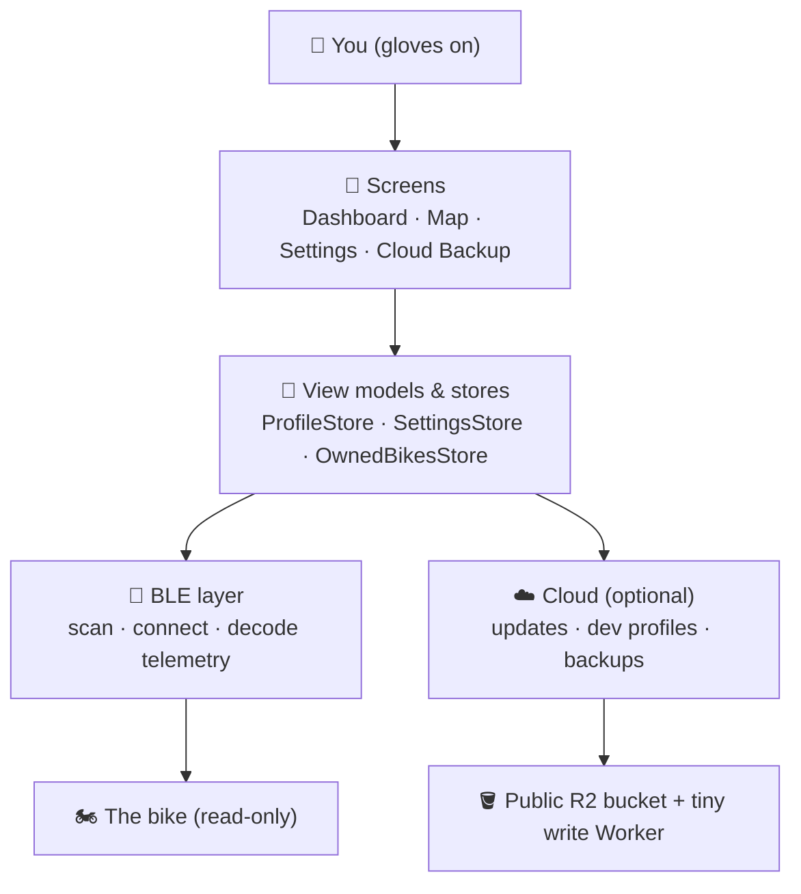
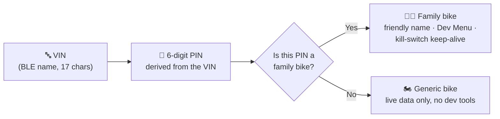
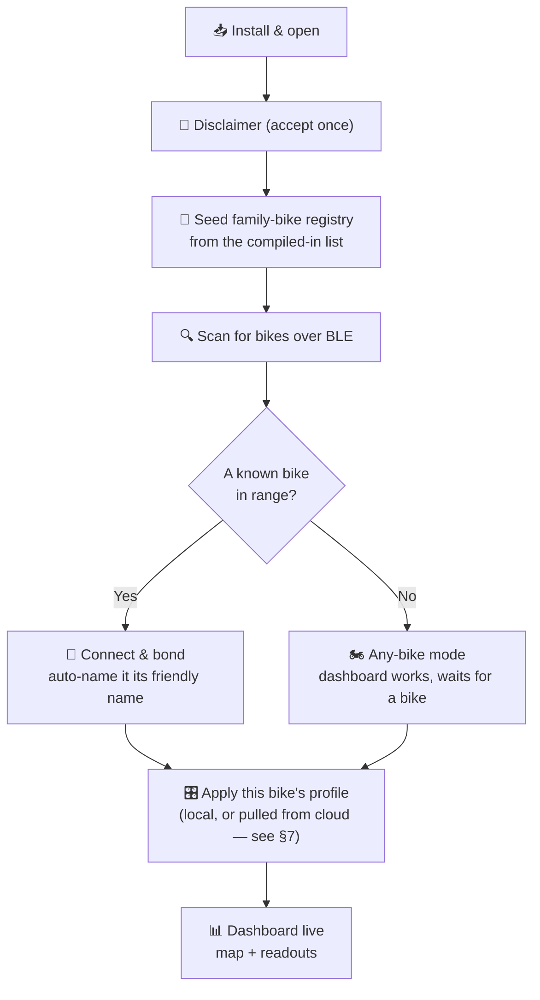
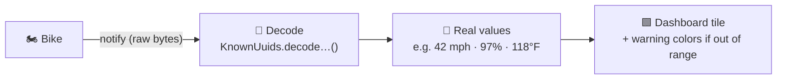
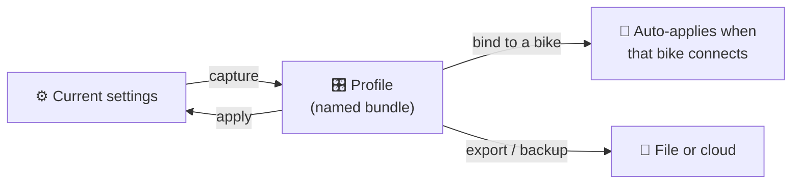
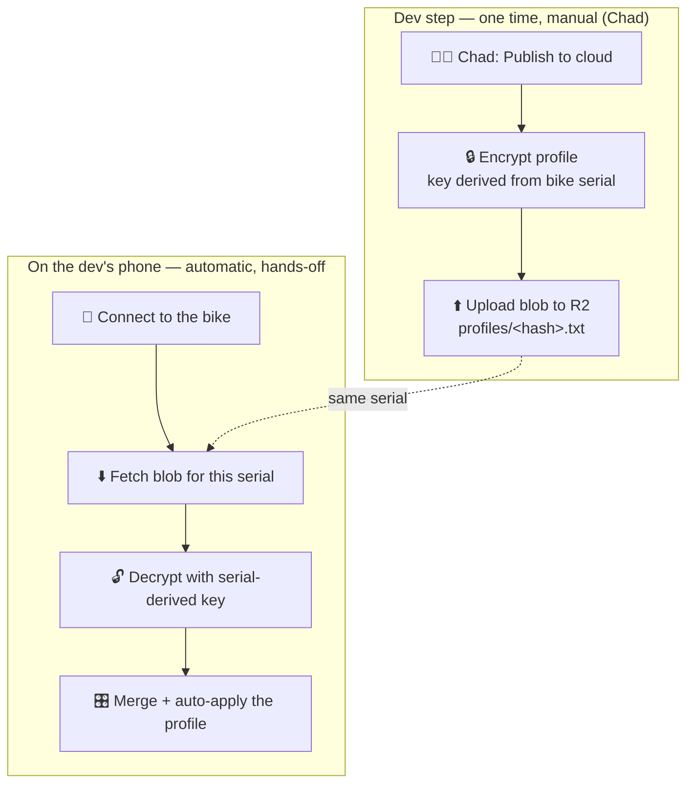
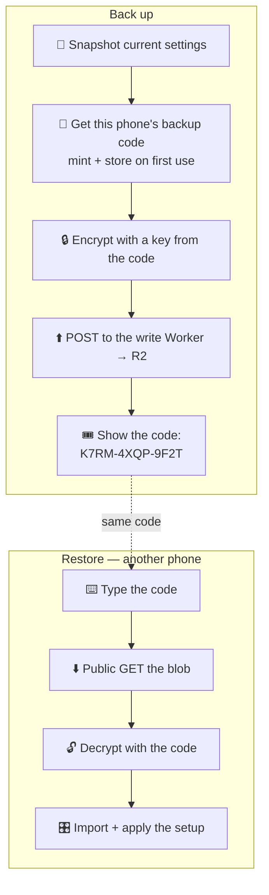
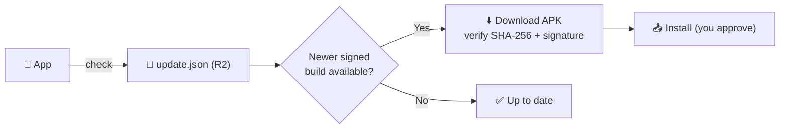
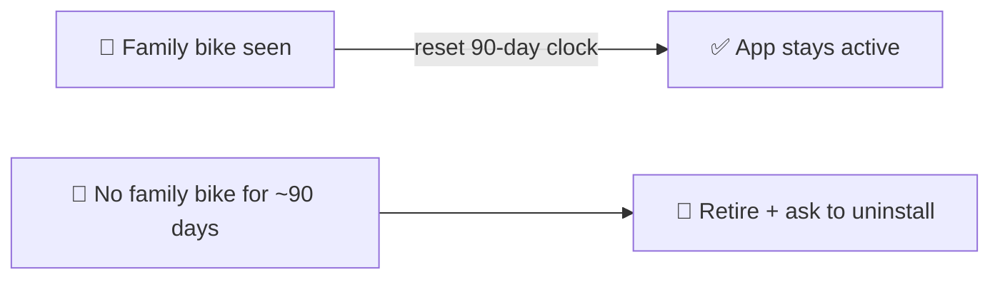
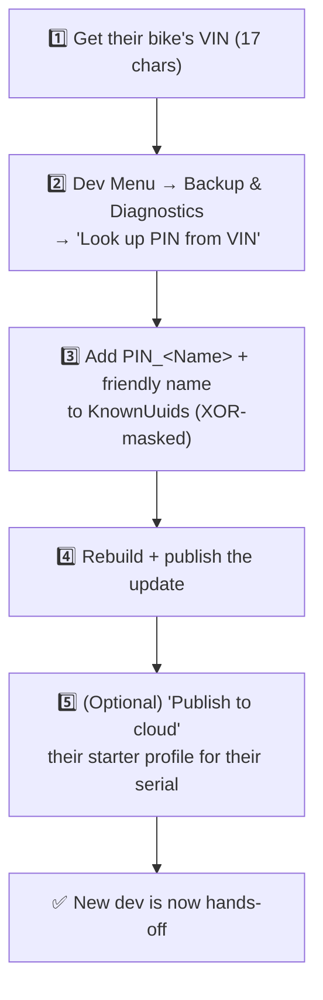

# WolfPack Dash — How It Works 🐺

A plain-English tour of how the app is put together and how its key processes flow — the
"what happens, in what order, and why" for the parts that matter. Written to be read top to
bottom like the [README](../README.md), or dipped into a section at a time.

> **Diagrams:** the flow trees below are [Mermaid](https://mermaid.js.org/) charts. They render
> automatically on GitHub and in most Markdown viewers. If you're reading this in a plain text
> editor and see the raw diagram code, the surrounding words still explain the whole flow on
> their own — the pictures are a bonus, not a requirement.

---

## Contents

1. [The big picture](#1-the-big-picture-️) 🗺️
2. [Two kinds of user: riders vs. the dev crew](#2-two-kinds-of-user-riders-vs-the-dev-crew-) 👥
3. [How the app knows *your* bike](#3-how-the-app-knows-your-bike-) 🔑
4. [First run → connected → riding](#4-first-run--connected--riding-) 🚀
5. [Live data: bike → dashboard](#5-live-data-bike--dashboard-) 📡
6. [Profiles & settings](#6-profiles--settings-️) 🎛️
7. [Dev profile sync (auto-setup a known bike)](#7-dev-profile-sync-auto-setup-a-known-bike-) ☁️
8. [Cloud backup for everyone (backup codes)](#8-cloud-backup-for-everyone-backup-codes-) 💾
9. [Staying current: updates](#9-staying-current-updates-) 🔄
10. [Safety & privacy model](#10-safety--privacy-model-) 🔒
11. [The dev roster & adding a new dev](#11-the-dev-roster--adding-a-new-dev-) 🧑‍🔧
12. [Quick reference: who does what](#12-quick-reference-who-does-what-) 📋

---

## 1. The big picture 🗺️

WolfPack Dash is a **glove-first dashboard for electric dirt bikes**. It reads the bike's
telemetry over Bluetooth Low Energy (BLE) and shows it on a big, bar-mounted screen — speed,
battery, range, temperatures, a live map, and more. It only ever **reads** from the bike; it
never sends commands to it.

The app is layered. Each layer only talks to the one below it:

Two things worth holding onto as you read the rest:

- **The map is the whole background.** Every dashboard is a full-screen live map with the
  instrument readouts floating on top of it. (That's why so much of the layout work is about
  keeping panels flush over the map.)
- **The bike is never required.** The app is fully usable with no bike connected ("any bike"
  phone-only mode). The bike just *adds* live data when it's there.

---

## 2. Two kinds of user: riders vs. the dev crew 👥

Everyone runs the **same freeware APK**. What differs is whether the app recognizes a bike as
"one of ours."

| | 🏍️ **Regular rider** | 🧑‍🔧 **Dev crew** (Chad, Colleen, Curtis, …) |
|---|---|---|
| Who | Anyone who installs the freeware | People whose bike is compiled in as a "family bike" |
| Bike recognized? | No — treated as a generic bike | Yes — by its VIN-derived PIN |
| Extra tools | None (clean, simple app) | Dev Menu: profiles, diagnostics, bike registry, cloud publish |
| Setup effort | **Zero — fully hands-off** | **Zero after Chad adds them once** |
| Cloud backup | ✅ backup codes (self-serve) | ✅ backup codes **+** auto-loading dev profiles |

The dividing line is a single check — `KnownUuids.isFamilyBike(pin)` — and it gates the Dev
Menu, the "welcome, owner" popup, auto-naming, and the kill-switch keep-alive (see §10). If the
app has never seen a family bike, none of the dev machinery ever appears.

---

## 3. How the app knows *your* bike 🔑

The bike advertises its **VIN** (a 17-character serial) as its Bluetooth name. From that VIN the
app derives a stable **6-digit pairing PIN** using a fixed formula. The PIN, not the raw VIN, is the
app's internal ID for a bike.

**Where the family list lives.** A short list of PINs is compiled into the app
(`KnownUuids.KNOWN_PIN_NAMES`). Those PINs are lightly **XOR-masked** so the actual digits and
serials aren't sitting in the source as plain, searchable text — not real security, just tidiness.
On first launch that list **seeds** an editable on-device registry (`OwnedBikesStore`), after which
a dev can add or retire bikes from the Dev Menu *on their own phone* without a rebuild.

> 🔎 The BLE name is a **lookup key, not a secret** — it's broadcast in the open. The real gate on
> anything sensitive is the actual Bluetooth pairing/bond to the physical bike, plus encryption on
> anything that touches the cloud (see §7 and §10).

---

## 4. First run → connected → riding 🚀

What happens from a fresh install to a live dashboard:

A couple of side-flows hang off "Dashboard live" the first time:

- **Seeded/restored settings apply themselves immediately** — if a profile arrived via a backup
  restore or the bundled seed, it takes effect on launch with *no bike connection needed*
  (`maybeApplySeededProfile`). That's what lets a dev's settings "just be there" on a fresh install.
- **A one-time "Electric / Gas" setup prompt** appears once, then never nags again.

---

## 5. Live data: bike → dashboard 📡

Once connected, the bike **pushes** telemetry (BLE "notify"). Each message is raw bytes for a
specific characteristic (speed, battery, temperatures…). The app decodes those bytes into real
numbers and units, then updates the matching tile.

The app interprets those bytes into real numbers and units, and is careful to mark which values are
**confirmed** against a real bike versus **best-guess** scale. The app never writes control data back
— it's an instrument display, not a controller.

---

## 6. Profiles & settings 🎛️

A **profile** is a named bundle of *everything a rider has changed away from the defaults* — theme
and colors, dashboard layout, orientation lock, brightness, units, warning thresholds, map figures.
It's the unit of "my setup."

- **Capture** snapshots the current settings into a profile (`SettingsSnapshot.capture`).
- **Apply** sets them all at once (`SettingsSnapshot.apply`).
- **Bind** ties a profile to a bike's PIN, so it re-applies automatically whenever that bike is
  recognized on connect — this is the "log in on the bike and it looks the way I like" behavior.

This is the shared plumbing that both the dev-profile sync (§7) and the everyone-backup (§8) ride
on top of.

---

## 7. Dev profile sync (auto-setup a known bike) ☁️

**Goal:** a dev (say Curtis) installs the freeware on a new phone, connects to *his* bike, and it
configures itself — his theme, layout, thresholds — with him doing nothing.

**How:** Chad publishes an **encrypted profile blob** for that bike's serial to the public R2
bucket, one time. Any phone that later connects to that physical bike pulls it, decrypts it, and
applies it.

Key points:

- **Keyed by the bike's serial.** Each dev's bike has its own VIN → its own blob → no collisions.
  Two devs never overwrite each other.
- **The bucket only ever holds ciphertext** (AES-256-GCM). The serial is a *lookup* key; the real
  gate is that you must have actually connected to that physical bike.
- **The app holds no cloud credentials.** Fetching is an anonymous public GET; the upload is done
  by Chad out-of-band from his own account.
- **It's just another delivery route** into the existing profile system — once the blob is merged,
  the normal bind/auto-apply from §6 takes over (`maybeAutoApplyProfile` → `tryCloudProfileFetch`).

---

## 8. Cloud backup for everyone (backup codes) 💾

**Goal:** *any* rider — no bike, no account — can save their setup and bring it back on another
phone, and Chad never has to do anything per user.

The catch a public bucket creates: R2 is read-only to the public, and you can't put a write
credential in a freeware APK (anyone could decompile it and wipe the bucket). So **restores are a
plain public download, and the one thing that writes is a tiny Cloudflare Worker** that holds the
only credential. Deploy it once → it serves every user forever, hands-off. *(Setup lives in
[worker/README.md](../worker/README.md).)*

The mental model is **"the stored code is my backup slot."**

- **First backup** mints a random ~60-bit code, stores it on the phone, and shows it. *Write it
  down — it's the only thing that can unlock the backup; there's no account to recover it.*
- **Later backups** silently reuse that code and overwrite the same slot — no juggling codes.
- **Restore** loads someone's setup one-way by default. A success prompt lets you *opt in* to
  adopt that code as your own slot (e.g. continuing your backup on a new phone), so restoring a
  friend's code never clobbers theirs.

Under the hood the code derives the **filename and the encryption key separately**, so even the
public filename can't unlock the blob — a deliberate hardening over the serial scheme in §7.
Reached at **Settings → Other screens → Cloud Backup**.

---

## 9. Staying current: updates 🔄

WolfPack Dash is freeware distributed outside any app store, so it updates itself from the same
public R2 bucket.

Every build is signed with the same developer key, and the download's fingerprint is checked
against the signed manifest, so a tampered or wrong-key file is refused.

---

## 10. Safety & privacy model 🔒

The guarantees the app is built to keep (full detail in the in-app Security screen /
[security.txt](../app/src/main/res/raw/security.txt), and a rigorous pen-test-oriented treatment in
[SECURITY_DEEP_DIVE.md](SECURITY_DEEP_DIVE.md)):

- **Your data stays on your phone.** No accounts; ride data, location, and telemetry are never
  uploaded. The only cloud traffic is map tiles, weather lookup, update checks, and — only if you
  use it — your *encrypted* settings backup.
- **The app holds no cloud credentials.** It reads public files anonymously; the write Worker holds
  the only key, and even it only ever stores ciphertext.
- **The bike is read-only.** The app displays telemetry; it never sends commands.
- **Kill switch (retirement).** This is a personal, non-commercial build. If a copy hasn't seen one
  of the family bikes in ~90 days, it retires itself and asks to be uninstalled — so old copies
  don't linger. Each dev *seeing their own bike* resets that clock, which is why a dev's bike being
  compiled in matters (§11).

---

## 11. The dev roster & adding a new dev 🧑‍🔧

**Current roster** (compiled in, recognized on any install):

| Bike | Rider |
|---|---|
| Chad's Fast Alpha | Chad |
| Colleen's Mighty Mini | Colleen |
| Slower Than Chad | Curtis |

Because all three are in the compiled-in family list, each of them is **hands-off in daily use**:
their bike is recognized automatically, their Dev Menu unlocks, their kill-switch clock stays reset
by riding their own bike, their dev profile auto-loads (§7), and updates arrive on their own (§9).

### Adding a new dev (one-time, manual — the part Chad is fine doing)

1. **Get the VIN** — the bike's 17-character serial (its Bluetooth name).
2. **Compute the PIN** — use the built-in **Dev Menu → Backup & Diagnostics → "Look up PIN from
   VIN"** tool. No guessing, no rebuild-to-test cycle.
3. **Add them to the family list** — in `KnownUuids.kt`, add a masked `PIN_<Name>` constant and an
   entry in `KNOWN_PIN_NAMES` (the existing `PIN_CURTIS` block documents exactly how the masking
   works and is the template to copy).
4. **Rebuild and publish** the update — the new dev (and everyone else) receives it automatically
   via the update channel.
5. **Optional: publish their starter profile** — from the Profiles screen, "Publish to cloud" for
   their bike's serial, so their bike auto-configures itself the first time they connect (§7).

After that one-time step, **that dev never does manual work** — and **regular riders never did any
to begin with.** Adding a dev is the *only* thing that requires you; everything else in this guide
runs itself.

> **Scale check for 2–5 devs:** the family list is a simple map, dev profiles are keyed per-serial
> (no collisions), and backups are per-code — nothing about this design strains at a handful of devs.
> It would comfortably handle far more; the only per-dev cost is that one compile-and-publish.

---

## 12. Quick reference: who does what 📋

| Action | Who | How often | Automatic? |
|---|---|---|---|
| Recognize a family bike | App | Every connect | ✅ Auto |
| Apply a bound profile | App | Every connect | ✅ Auto |
| Auto-load a dev's cloud profile | App | First connect on a new phone | ✅ Auto |
| Rider backs up / restores their setup | Rider | Whenever they want | ✅ Self-serve (code) |
| Check for & install updates | App / rider approves | Periodically | ✅ Auto (approve install) |
| Publish a dev's starter profile | Chad | Once per dev | ✍️ Manual |
| Add a brand-new dev bike | Chad | Once per dev | ✍️ Manual |
| Deploy the backup Worker | Chad | **Once, ever** | ✍️ Manual |

---

*This guide describes the app as built. For the code-level "why" behind any specific decoder,
screen, or store, the source files carry detailed comments; this document is the map that tells you
which one to open.*
