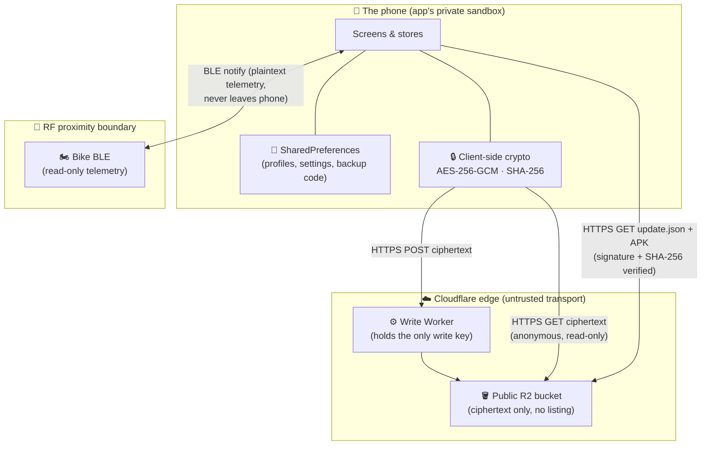
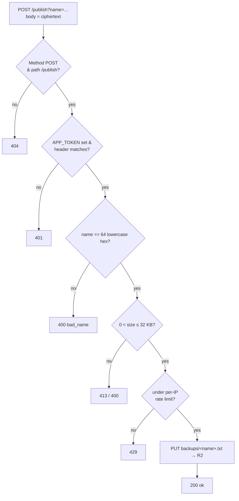

# WolfPack Dash — Security Deep Dive 🔒

A rigorous, security-engineer-oriented walkthrough of the app's trust boundaries, attack surface,
cryptography, and honest limitations. Where the [Process Flow guide](PROCESS_FLOW.md) answers *"how
does it work,"* this answers *"what stops it from being abused, and where are the edges."*

**Who this is for.** Two readers at once:
- **The pen tester / security engineer** — you'll find a threat model, a data-flow diagram with
  trust boundaries, an attack-surface enumeration, a crypto review, and a frank limitations section.
- **The semi-technical reader** — every term is defined in plain language the first time it's used,
  and each attack scenario is written as a little story ("what if someone tried to…") before the
  jargon. You do not need a security background to follow it.

> **Honesty policy.** This document deliberately calls out what is **obfuscation vs. real security**,
> what is **not** protected, and what the **residual risk** is after each mitigation. WolfPack Dash is
> a **personal, non-commercial, freeware** build for a handful of friends and their dirt bikes — not a
> banking app. The goal here is an accurate model, not a marketing sheet. Overclaiming would be worse
> than useless to the people who rely on it.

---

## Contents

1. [System recap & security-relevant components](#1-system-recap--security-relevant-components)
2. [Data classification: what are we protecting?](#2-data-classification-what-are-we-protecting)
3. [Threat model](#3-threat-model)
4. [Trust boundaries & data-flow diagram](#4-trust-boundaries--data-flow-diagram)
5. [Attack surface enumeration](#5-attack-surface-enumeration)
6. [Cryptography deep dive](#6-cryptography-deep-dive)
7. [Secrets inventory: what ships in the APK](#7-secrets-inventory-what-ships-in-the-apk)
8. [Abuse-case walkthroughs](#8-abuse-case-walkthroughs)
9. [The write Worker, in detail](#9-the-write-worker-in-detail)
10. [Anti-persistence: the kill switch](#10-anti-persistence-the-kill-switch)
11. [Honest limitations & recommended hardening](#11-honest-limitations--recommended-hardening)
12. [Reviewer's quick checklist](#12-reviewers-quick-checklist)

---

## 1. System recap & security-relevant components

WolfPack Dash is an Android app that reads a dirt bike's telemetry over Bluetooth Low Energy (BLE)
and optionally talks to a small amount of cloud infrastructure for updates and backups. The pieces
that matter for security:

| Component | What it is | Trust level |
|---|---|---|
| **The APK** | The app binary, distributed as freeware (installable by anyone) | **Fully untrusted** — assume any attacker has it and has decompiled it |
| **Local storage** | `SharedPreferences` files in the app's private data dir | Trusted on a non-rooted device; untrusted on a rooted/compromised one |
| **BLE link** | Connection to the physical bike | Semi-trusted — proximity-gated, but the pairing material is weak (see §5.3) |
| **R2 bucket (read)** | A public Cloudflare R2 bucket serving updates, dev profiles, and backups | Public read, **no listing**; integrity via signatures/GCM |
| **Write Worker** | A Cloudflare Worker that is the *only* thing that can write to the bucket | Holds the sole write credential; server-side, out of the APK |
| **Backup code** | A random per-phone code that encrypts a user's cloud backup | The one genuine user secret in the system |

Two architectural facts drive most of the security posture:

1. **The app holds no cloud write credentials.** Reads are anonymous public GETs; writes go through
   the Worker, which holds the credential server-side. So decompiling the APK yields no key that can
   damage the bucket.
2. **Everything that touches the cloud is encrypted client-side.** The bucket only ever stores
   ciphertext (AES-256-GCM). The cloud is a dumb pipe; it never sees plaintext settings.

---

## 2. Data classification: what are we protecting?

Classifying the data tells us how hard we actually need to try. Most of what this app handles is
**low sensitivity** — that's a finding, not a hand-wave.

| Data | Sensitivity | Where it lives | Leaves the phone? |
|---|---|---|---|
| Ride telemetry (speed, battery, temps) | Low | RAM + optional local logs | **Never** |
| GPS location / ride tracks | **Medium** (reveals where you ride/live) | Local only | **Never uploaded** |
| Settings profile (theme, layout, thresholds) | Low (look-and-feel; **no telemetry**) | Local + *encrypted* cloud backup | Only as ciphertext, opt-in |
| Bike VIN / serial | Low (it's **broadcast** over BLE) | Derived to a PIN; not stored raw in cloud | It's public by nature |
| Backup code | **Medium** (unlocks a backup slot) | Local `SharedPreferences`, shown to user | Only in the user's own hands |
| Bonding PIN | Low (derivable from the public VIN) | Computed on demand | No |

**Key takeaway for a reviewer:** the two genuinely sensitive assets are **GPS/location data**
(mitigated by *never uploading it*) and the **backup code** (mitigated by high entropy + client-side
encryption). Everything cloud-bound is deliberately low-value look-and-feel data, which is why the
serial-derived profile scheme (§6.2) is acceptable despite its weaknesses.

---

## 3. Threat model

**Assets** (in priority order): (1) the rider's location/ride data, (2) the integrity of app updates,
(3) the availability & integrity of the cloud bucket, (4) the confidentiality of settings backups.

**Adversaries we design against:**

- **A1 — Remote internet attacker.** Has the APK, can hit the R2 bucket and the Worker, can sniff
  network metadata. Cannot get on the BLE link (not in physical range).
- **A2 — Nearby RF attacker.** Within Bluetooth range of a bike; can observe advertisements and
  attempt to connect/pair.
- **A3 — Malicious app on the same phone.** Another installed app trying to reach WolfPack Dash's
  exported components or data.
- **A4 — Curious/abusive user.** A legitimate user poking at the cloud endpoints, trying to read
  others' backups or flood the bucket.

**Explicitly out of scope** (accepted risks for a personal freeware build):

- A **rooted or physically-compromised** phone. Once an attacker has root on the device, local app
  data (including the plaintext backup code) is theirs. We do not defend against this.
- A **nation-state / well-resourced** adversary specifically targeting this app. Not the threat.
- **The bike's own BLE security.** We consume the manufacturer's scheme as-is; its weaknesses
  (§5.3) are the bike's, not something this app can fix.

**Security goals:** location never leaves the phone; updates cannot be spoofed or downgraded to a
different-key binary; the bucket cannot be wiped/vandalized by an APK holder; one user cannot read or
overwrite another user's backup without their code.

---

## 4. Trust boundaries & data-flow diagram

A **trust boundary** is a line where data crosses from something you control into something you
don't (or vice-versa). Attacks happen at these lines. The dashed boxes below are the boundaries.



Reading the boundaries:

- **Phone ↔ Bike (RF boundary).** Telemetry crosses here in plaintext, but it stays inside the phone
  afterward. An A2 attacker in range can also read the bike's broadcasts — but so can anyone; that
  data isn't secret.
- **Phone ↔ Cloudflare (network boundary).** Only ever **ciphertext** or **signed** artifacts cross
  here, over **HTTPS**. The transport (Cloudflare, the ISP) is treated as untrusted; confidentiality
  and integrity are enforced *before* data reaches it (GCM encryption; signature/hash verification).
- **Write vs. read split.** Writes must pass through the Worker (which enforces policy and holds the
  credential); reads bypass it entirely as public GETs. This asymmetry is central — see §8 and §9.

---

## 5. Attack surface enumeration

Every place untrusted input can enter, or an attacker can poke.

### 5.1 The APK itself

The binary is freeware — **assume the adversary has decompiled it** (`jadx`, `apktool`). Therefore:

- **No secret in the APK may be load-bearing.** The security review reduces to: *what does the app
  ship, and what happens if an attacker reads it?* — answered in the [Secrets inventory](#7-secrets-inventory-what-ships-in-the-apk).
- **`android:allowBackup="true"`** — on devices/flows where `adb backup` works, app-private data
  (including the plaintext backup code) can be extracted **with physical access + USB debugging**.
  This is an accepted, low-severity risk (it requires the same physical access that already breaks
  the out-of-scope "device compromise" line). Flagged as a hardening candidate in §11.
- **No obfuscation of logic** (R8 minification aside). Anti-reverse-engineering is explicitly **not**
  a goal; the design assumes transparency (it's open source).

### 5.2 Local storage & inter-process communication (IPC)

- **`SharedPreferences`** live in the app's private data directory — unreadable by other apps on a
  non-rooted device (OS sandbox). The backup code and profiles sit here in plaintext. Threat A3
  (malicious co-installed app) **cannot** read them without root.
- **Exported components = attack surface from other apps.** Exactly **one** component is exported:
  `SplashActivity` (`exported="true"`, the launcher). It forwards a small set of intent extras
  (e.g. "open About," "start demo") to internal screens. **Risk:** any app can launch it with those
  extras. **Impact:** limited to navigating the app's own UI — no extra reads `EXTRA_*` boolean flags
  that grant privilege, move money, or exfiltrate data. Everything else is `exported="false"`.
- **`FileProvider`** (`exported="false"`) hands out **temporary, read-only** `content://` URIs for
  the share sheet (exporting logs/backups the user explicitly chose to share). Grants are per-intent
  and time-boxed; no persistent world access.
- **`DebugRouterActivity`** — a deep-link hook that can open any screen — lives in **`src/debug`
  only**. It is **not compiled into, and has no manifest entry in, the release build.** It is not an
  attack surface for shipped app users.

### 5.3 BLE (the RF boundary)

This is the weakest link, and it's mostly **inherited from the bike manufacturer**, not chosen by us:

- **The bonding PIN is not independent secret material.** The bike's Bluetooth pairing is tied to its
  own broadcast identifier — the VIN it advertises as its BLE name — by the bike's design, so the PIN
  isn't a secret separate from that public identifier. Since the **VIN is broadcast**, being in range
  is effectively enough to pair. **The PIN is therefore not a secret.**
- **The link handshake adds no server-side gate.** It depends only on values already available at the
  link (the bike's identifier and a per-connection nonce) — no account, no server, no shared secret.
- **Consequence:** the "security" of the BLE link is **physical proximity**, not cryptographic. An
  A2 attacker in range could, in principle, connect to a bike. **But:** the app is *read-only* (§5 has
  no write path to the bike), the telemetry isn't secret, and the attacker gains nothing but the same
  numbers on the bike's own dashboard. There is **no remote (A1) BLE attack** — it requires physical
  RF proximity to that specific bike.
- **What this means for cloud features:** the dev-profile scheme (§6.2) leans on "you must have
  connected to the physical bike" as a gate. Given the above, that gate is *proximity*, not a strong
  secret — which is exactly why dev-profile payloads are restricted to non-sensitive look-and-feel
  data.

### 5.4 Cloud read path (public GET)

- Anyone can GET any object **if they know its name**. Object names are **256-bit hashes**; the
  bucket has **no public listing**, so names cannot be enumerated — an attacker must *guess the input*
  (a serial, or a backup code) that hashes to a valid name.
- **Integrity** on read is enforced by AES-GCM's authentication tag (a tampered blob fails to
  decrypt) and, for updates, by APK signature + SHA-256 verification. A malicious edge that swaps a
  blob's bytes causes a clean decryption failure, not silent corruption.
- **Reads are NOT rate-limited by the Worker** (they don't go through it). Read-side brute-force
  resistance rests entirely on **input entropy** (see §6.3 and §8-C), not on a rate limiter.

### 5.5 Cloud write path (the Worker)

The only way to write. Full detail in §9. Summary of what it constrains: POST-only, one route,
object names restricted to 64-hex under `backups/`, 32 KB size cap, per-IP rate limit, optional
shared token. It cannot be made to write outside `backups/<hex>.txt`.

### 5.6 Network / transport

- **All cloud endpoints are HTTPS** (R2 `r2.dev` and the `workers.dev` Worker). No cleartext HTTP is
  used; there is **no `usesCleartextTraffic` override and no permissive network-security-config**, so
  the platform default (block cleartext on modern target SDK) applies.
- **No certificate pinning.** Accepted: the payloads are already end-to-end encrypted/signed, so a
  TLS-MITM (which itself requires a trusted rogue CA on the device) still can't read plaintext or
  forge a validly-signed update. Pinning is a possible hardening (§11) but low-value here.

---

## 6. Cryptography deep dive

### 6.1 Primitives

| Primitive | Choice | Notes |
|---|---|---|
| Symmetric cipher | **AES-256-GCM** (`AES/GCM/NoPadding`) | Authenticated encryption — confidentiality **and** integrity in one |
| Key size | 256-bit | The full SHA-256 digest is used directly as the key |
| KDF / hashing | **SHA-256** (`MessageDigest`) | Keys and object names are derived via labeled SHA-256 |
| IV / nonce | **12 bytes**, fresh from `SecureRandom` per encryption | Standard GCM nonce length |
| Auth tag | **128-bit** | Full-length GCM tag |
| Encoding | Base64 (`NO_WRAP`) of `IV ‖ ciphertext‖tag` | Stored as plain text so a GET needs no binary handling |
| RNG | `java.security.SecureRandom` | CSPRNG for IVs and backup codes |

**GCM nonce-reuse note.** GCM is catastrophic if an (key, IV) pair repeats. Here IVs are random
96-bit values from a CSPRNG, and each key is essentially single-use (one serial / one code), so the
birthday bound (~2⁴⁸ encryptions per key before meaningful collision risk) is astronomically beyond
this app's volume. **No nonce-reuse exposure in practice.**

### 6.2 Serial-derived path (dev profiles) — and its honest weakness

Used when a dev publishes a profile keyed to a bike's serial:

```
digest   = SHA-256( "wolfpackdash/profile/v1" | serial )
filename = hex(digest)              // the object name in the bucket
AES key  = digest                   // the SAME 32 bytes
```

⚠️ **Weakness (by design trade-off):** the filename is the key, in hex. Anyone who obtains a
serial-path object's **name** can hex-decode it straight into the AES key. Combined with the fact
that the **serial is public** (broadcast over BLE), the confidentiality of a serial-path blob really
rests on:

1. the attacker **not knowing which serial to target** (and the bucket having no listing), and
2. the payload being **non-sensitive look-and-feel data** with **no telemetry**.

This is **obfuscation-grade**, not strong confidentiality, and the code says so. It's acceptable
*only* because of the data classification (§2). The documented future hardening is to mix a value
read over the bonded BLE link into the key so the serial alone isn't enough.

### 6.3 Backup-code path (everyone) — the hardened design

Used for user cloud backups. The backup **code** is a random secret, and — unlike the serial path —
**name and key are derived separately:**

```
name = SHA-256( "wolfpackdash/backup/v1/name" | normalize(code) )   → hex → object name
key  = SHA-256( "wolfpackdash/backup/v1/key"  | normalize(code) )   → AES-256 key
```

Because the two use **different domain-separation labels**, the object name and the key are
**cryptographically unrelated** outputs of SHA-256. This was independently verified (round-trip
succeeds; name ≠ key; a wrong code fails the GCM tag; and critically, **feeding the public filename
back in as a key fails to decrypt**). So even if every backup name in the bucket leaked, the blobs
stay confidential.

**Entropy analysis.** The code is **12 characters** from a **32-symbol** Crockford alphabet (no
ambiguous `I/L/O/U`) = **32¹² = 2⁶⁰** possibilities. To find *any* valid backup, an attacker must
guess a code, hash it to a name, and GET it (a 404 means "wrong"). This is an **online** search
(reads aren't behind the Worker's rate limiter, so entropy — not rate-limiting — is the control):

- At an optimistic sustained **10⁴ GETs/sec**, 2⁶⁰ / 10⁴ ≈ **3.6 × 10¹⁴ seconds ≈ millions of
  years**. Infeasible.
- `normalize()` folds case, dashes, spaces, and look-alikes (`I/L→1`, `O→0`) **before** hashing, so
  usability doesn't cost entropy — the 2⁶⁰ space is over the canonical alphabet.

**Residual crypto risks (stated plainly):** (a) a **partial-knowledge** attack — if an attacker
shoulder-surfs or overhears most of a code, the remaining space can shrink into brute-forceable
range; mitigated by codes being random and never user-chosen, but real. (b) The code lives in
`SharedPreferences` in **plaintext at rest** — a rooted/backup-extracted phone (out-of-scope A-lines)
exposes it. (c) The user is told **the code is unrecoverable** — a usability/availability trade
(there's no account to reset it), not a confidentiality flaw.

### 6.4 Update integrity (a different mechanism)

Updates aren't encrypted (the APK is public freeware) — they're **integrity-protected**:

- Each build is signed with the **developer's signing key**; Android refuses to install an update
  signed with a *different* key over an existing install (blocks key-swap attacks).
- Before install, the download's **SHA-256** is checked against the value in the signed
  `update.json` manifest — a tampered or truncated download is rejected.
- Net effect: an A1 attacker who controls the transport still cannot get a modified or attacker-signed
  APK installed; the worst they can do is deny the update (availability, not integrity).

---

## 7. Secrets inventory: what ships in the APK

The whole point of enumerating this: **decompiling the APK reveals all of the below, and none of it
lets an attacker break a security goal.**

| "Secret" in the binary | What it really is | If an attacker extracts it… |
|---|---|---|
| XOR-masked bike PINs (`PIN_CHAD`, etc.) | **Obfuscation, not security** — XOR `0x5A` over 6 digits, to keep PINs out of plain-text search/git history | They get 6-digit PINs that are *already derivable from the public VIN anyway*. No new capability. |
| Key-derivation salt/labels (`wolfpackdash/…/v1`) | Domain-separation constants, **not secret** | Nothing — they only bind derivations to this app; knowing them doesn't help without the serial/code. |
| Bike-name hint fragments | XOR-masked brand strings (keeps the manufacturer name out of grep) | A brand name. Irrelevant to security. |
| `APP_TOKEN` (Worker) | A shared header token that **ships in the APK** → **reversible** | They can script the write endpoint — but still only within its hard limits (§9). It's an anti-drive-by speed bump, **not** an auth secret, and the code says so. |
| **R2 write credentials** | **Not present** | N/A — the app never holds one. This is the single most important line in the table. |

**Reviewer's takeaway:** the secrets inventory is intentionally empty of anything load-bearing. The
security model does **not** depend on the binary being opaque.

---

## 8. Abuse-case walkthroughs

Each scenario: the *story*, then difficulty / impact / mitigation / residual risk.

### A. "I decompiled the APK — what can I break?"
- **Story:** attacker pulls the APK, runs `jadx`, reads everything.
- **Difficulty:** trivial. **Impact:** **none** on the security goals — see §7.
- **Residual:** they learn how it works (it's open source anyway).

### B. "I'll wipe or vandalize the cloud bucket."
- **Story:** attacker wants to delete everyone's updates/backups.
- **Mitigation:** the APK carries **no write credential**; the only writer is the Worker, which
  **only** accepts `POST /publish` and **only** writes `backups/<64-hex>.txt`. There is no delete
  route and no way to target `update.json` or `profiles/`.
- **Residual:** they can *add* junk backup objects (see I), not destroy existing data.

### C. "I'll brute-force backup codes to read strangers' setups."
- **Story:** guess codes, hash to names, GET blobs.
- **Difficulty:** **2⁶⁰** online guesses; ~millions of years at optimistic rates (§6.3). **Impact:**
  even a hit yields only low-value look-and-feel settings.
- **Residual:** **partial-knowledge** attacks (overheard/shoulder-surfed codes) shrink the space —
  the main real-world risk, mitigated by random codes and the "keep it safe" UX.

### D. "I know a target's backup code (they shared/leaked it)."
- **Story:** attacker has the actual code.
- **Reality:** that's **by design** how sharing works — the code *is* the credential. Whoever holds
  it can read **and overwrite** that slot. **Impact:** limited to that one slot's look-and-feel data.
- **Mitigation:** "Start a new backup code" mints a fresh slot, orphaning the leaked one (it expires
  via lifecycle). Restore-doesn't-adopt-by-default keeps a shared code from silently hijacking your
  own slot.

### E. "I know a dev's bike serial — can I read/poison their profile?"
- **Read:** yes, in principle — the serial-path key is serial-derived and the serial is public
  (§6.2). **Impact:** you read their *theme and layout*. No telemetry, no location, nothing sensitive.
- **Poison (overwrite):** **no** — serial-path profiles live under `profiles/`, and the Worker only
  writes under `backups/`. Publishing a profile is a manual dev upload from a credentialed account,
  not something the public write path can reach.
- **Residual:** confidentiality of *look-and-feel* dev profiles is weak-by-design; flagged in §11.

### F. "I'll MITM the network."
- **Story:** attacker intercepts cloud traffic.
- **Mitigation:** all HTTPS; payloads are **already encrypted (GCM)** or **signed (updates)** end to
  end. A successful TLS-MITM (needs a rogue trusted CA on the device — outside A1) still can't read
  plaintext or forge a valid-signed update.
- **Residual:** metadata (which endpoints you hit, blob sizes). Low.

### G. "I'll push a malicious update."
- **Mitigation:** signature-key match + SHA-256 manifest check (§6.4). A different-key or altered APK
  is refused by Android / the app.
- **Residual:** **denial** of updates (serve an old/blocked file). Availability only.

### H. "I'm next to the bike — can I attack over BLE?"
- **Story:** A2 attacker in RF range.
- **Reality:** the pairing PIN and auth are VIN-derived and the VIN is broadcast, so proximity ≈
  access (§5.3). **But** the app is read-only and the telemetry isn't secret, so the attacker gains
  nothing they couldn't read off the bike's own dashboard.
- **Residual:** this is the **bike manufacturer's** weak scheme; not fixable app-side. No remote
  (A1) exposure.

### I. "I'll flood the write Worker to run up costs / fill the bucket."
- **Mitigation:** 32 KB size cap + per-IP rate limit (KV, 30/hr) + hex-name confinement + optional
  token. Object lifecycle auto-expires abandoned `backups/` objects (~365 days).
- **Residual:** a **distributed** flood (many IPs) could still add objects up to the caps — bounded
  by size × rate × lifecycle, and Cloudflare's own free-tier limits. For a personal app, acceptable;
  hardening options in §11.

### J. "I have the unlocked phone / root."
- **Reality:** **out of scope** (§3). Local plaintext (backup code, profiles) is exposed. Accepted.

---

## 9. The write Worker, in detail

The Worker (`worker/src/index.js`) is the trust anchor for writes. It is small on purpose — a small
attack surface is an auditable one. Request handling:



Why each check exists:

- **POST-only, `/publish`-only:** no read/list/delete verbs are exposed at all.
- **64-hex name regex:** the single most important control — it **confines every write to
  `backups/<hex>.txt`**. There is no input that makes the Worker write to `update.json`,
  `profiles/`, or any path an attacker chooses. Path traversal is impossible (no separators allowed).
- **Size cap (32 KB):** a settings blob is a few KB; the cap bounds storage-abuse per request.
- **Per-IP rate limit (KV):** bounds single-source flooding.
- **Optional shared token:** an anti-scripting speed bump (reversible — §7), not authentication.
- **The R2 credential is a Worker binding** — server-side, never transmitted to or stored in the app.

The Worker deliberately does **no** decryption and stores exactly what it's given, so it never
handles plaintext and can't leak it.

---

## 10. Anti-persistence: the kill switch

A security-adjacent design goal unique to a personal build: **old copies shouldn't linger in the
wild.** If an install hasn't seen one of the family bikes in ~90 days, it **retires itself** and asks
to be uninstalled (`KillSwitch`). Seeing a family bike resets the clock
(`KillSwitch.recordFamilySeen`).

- **Security value:** limits the lifespan and spread of the app to people who actually stay near a
  family bike — a soft distribution control for a build that's shared person-to-person.
- **Not a DRM / tamper-proof mechanism** — a determined user could patch it out of the open-source
  APK. It's a *hygiene* control, not an enforcement one, and is honestly framed as such.

---

## 11. Honest limitations & recommended hardening

Ranked roughly by value. None are critical for the stated threat model; all would raise the bar.

1. **Serial-path profile confidentiality is obfuscation-grade** (§6.2): filename = key, serial is
   public. *Hardening:* derive the key with a separate label (as the backup path already does) **and**
   mix in a value read over the bonded BLE link, so the public serial alone can't decrypt.
2. **`APP_TOKEN` is reversible** (ships in the APK). *Hardening:* have the app compute an **HMAC over
   the request body** with an app-embedded key — still not a true secret, but forces per-request work
   and ties the token to the payload, raising the scripting bar. (True auth would need per-user
   accounts, which is explicitly out of scope.)
3. **`allowBackup="true"`** exposes local data to `adb backup` with physical access. *Hardening:* set
   `allowBackup="false"` (or exclude the prefs holding the backup code via backup rules).
4. **Backup code at rest is plaintext** in `SharedPreferences`. *Hardening:* wrap it with the Android
   **Keystore** (`EncryptedSharedPreferences`) so a backup-extraction/root read yields ciphertext.
5. **No read-side rate limiting** on backup lookups. *Mitigated today by 2⁶⁰ entropy*, but a
   defense-in-depth option is to route reads through the Worker (or a Cloudflare rule) to throttle
   guessing — at the cost of read latency and Worker load.
6. **No TLS pinning.** Low value given end-to-end crypto, but pins would harden against a
   rogue-CA-on-device scenario.
7. **BLE proximity ≈ access** (§5.3) is inherited from the bike; unimprovable app-side, but worth
   documenting so no one over-trusts the "must have connected to the bike" gate.

---

## 12. Reviewer's quick checklist

For a pen tester doing a fast pass, the high-signal things to verify:

- [ ] **No cloud write credential in the APK** (grep the decompiled source; confirm only the Worker
      writes). ✔ by design.
- [ ] **Worker confines writes to `backups/<64-hex>.txt`** (try path traversal, other verbs, oversized
      bodies, bad names). ✔ enforced.
- [ ] **Cloud blobs are ciphertext** (pull an object; confirm it's base64 AES-GCM, not readable). ✔.
- [ ] **Backup name ≠ key** (confirm the filename can't decrypt the blob). ✔ verified.
- [ ] **Update install requires matching signature + SHA-256** (try a re-signed / altered APK). ✔.
- [ ] **Only `SplashActivity` is exported**, and its extras grant no privilege (fuzz the intent
      extras). ✔.
- [ ] **No cleartext traffic / permissive network config**. ✔.
- [ ] **Location/telemetry never leave the device** (watch traffic during a ride). ✔ by design.
- [ ] Known trade-offs acknowledged: serial-path obfuscation, reversible `APP_TOKEN`, `allowBackup`,
      plaintext code at rest, BLE proximity gate. ✔ documented in §11.

---

*Pairs with the [Process Flow guide](PROCESS_FLOW.md) (how it works) and the in-app
[security.txt](../app/src/main/res/raw/security.txt) (the user-facing promise). This deep dive
reflects the current build, including the user backup-code cloud-backup path and its write Worker.*
